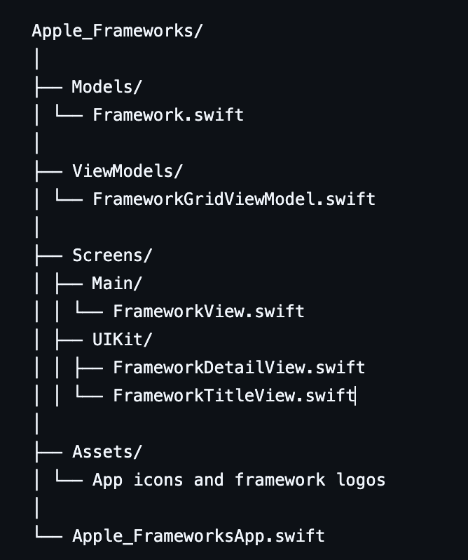
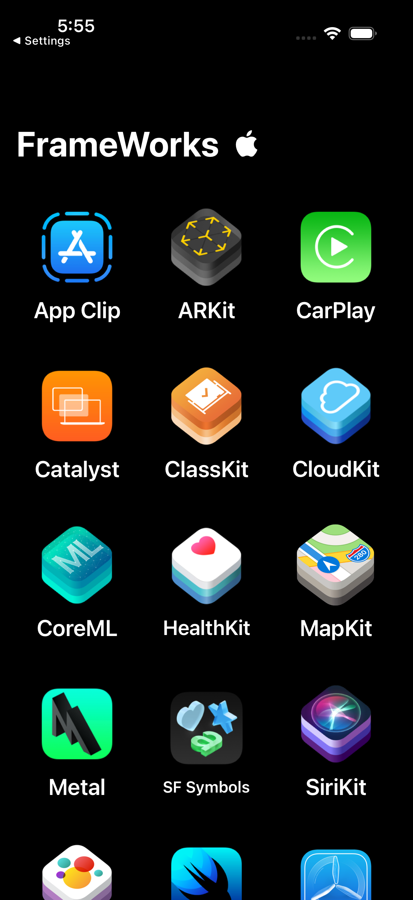
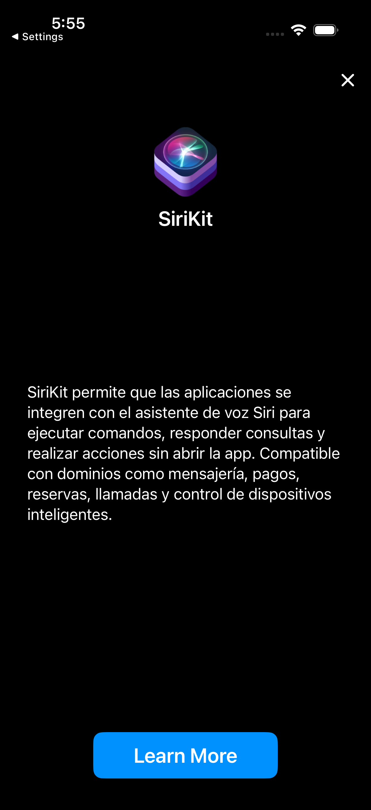
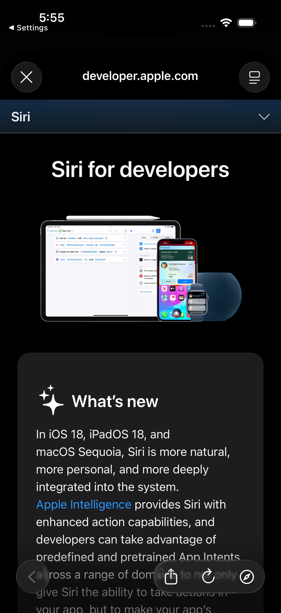

# 🍎 Apple Frameworks Explorer  

A **learning project** showcasing several **Apple frameworks** using **SwiftUI + UIKit integration**.  
It displays a grid of Apple frameworks, allowing users to select one and explore its official documentation directly inside the app via **WebKit**.

---

## ✨ Features

- 🧩 **Interactive Grid of Frameworks**  
  - Displays Apple frameworks like ARKit, CoreML, HealthKit, SiriKit, and more.  
  - Built with **SwiftUI LazyVGrid** for smooth and responsive layout.  

- 🌐 **UIKit + SwiftUI Integration**  
  - Opens each framework’s **official Apple Developer page** using **WebKit**.  
  - Demonstrates how to bridge UIKit components into SwiftUI views.  

- 🪄 **Smooth Transitions & Animations**  
  - Subtle transitions between grid and detail views using SwiftUI’s `.transition()` and `.animation()`.  

- 📚 **Educational Purpose**  
  - Built as a hands-on exercise for mastering SwiftUI, MVVM, and UIKit interoperability.  

---

## 🛠️ Tech Stack

| Category | Technology |
|-----------|-------------|
| 🧩 Language | Swift (6.0) |
| 🎨 UI Framework | SwiftUI |
| 🧱 Architecture | MVVM |
| 🧭 Navigation | NavigationStack |
| 🌐 Web Integration | UIKit `WKWebView` via UIViewRepresentable |
| 🧰 IDE | Xcode 16+ |
| 🖥️ iOS Version | iOS 17+ |

---

## 📂 Project Structure

---

## 🧭 User Flow

1. Launch the app — view all available Apple frameworks in a grid.  
2. Tap a framework to view details and its logo.  
3. Tap “Learn More” to open the **official Apple Developer page** via **WebKit**.  
4. Return smoothly to the main grid with animated transitions.  

---

## 🧪 Requirements

- iOS **17.0+**  
- Xcode **16.0+**  
- Swift **6.0+**  
- macOS **Sonoma** or later  

---

## 📸 Screenshots

| 🏠 Home | 📚 Framework Details | 🌐 WebKit View |
|:--------:|:------------------:|:---------------:|
|  |  |  |

---

## 🧑‍💻 Author

**German Bonnettini**  
iOS & Game Developer  
🎮 Passionate about creative app design, animation, and interactive learning projects.  
📍 [Matecode Studio](https://matecodestudio.io/)

---

## 🚀 Roadmap

- 🧠 Add CoreML demo integration for educational showcase  
- 🔍 Add search bar for frameworks  
- 💬 Add short framework summaries via JSON file  
- ☁️ Add SwiftData persistence for custom favorites list  

---

## 🏷️ License

This project is available under the **MIT License**.  
You’re free to use, learn, and expand upon it — attribution to **Matecode Studio** is appreciated.
